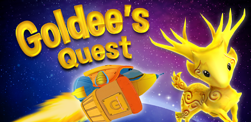
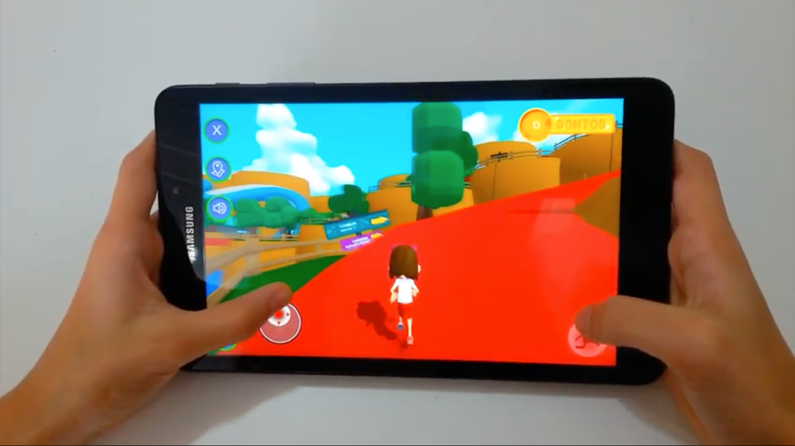
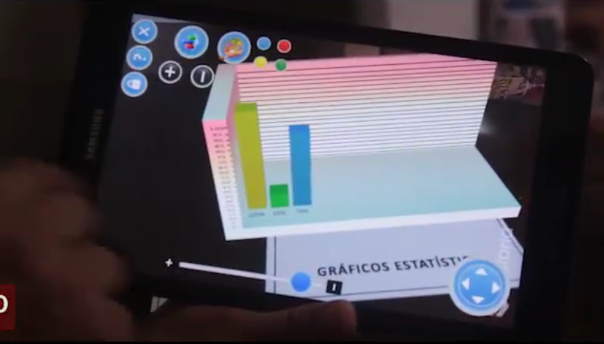

# Ruilan Berg
## Sobre Mim
Olá, meu nome é Ruilan Berg e eu sou um _gameplay programmer_. Meus principais interesses são jogabilidade e programação gráfica. Adoro criar a sensação de um jogo, como fazer um salto suave ou melhorar a velocidade de movimento.

## Projetos Profissionais

### Goldee's Quest
  
Video: [Link](https://www.youtube.com/watch?v=948ouaNEe90)

#### Dados:
*   Duração total de produção de 6 meses.
*   Tecnologia: Unity, C#, Android Studio e Java.

#### Minha Contribuição:
*   Polimento do projeto que passou já por diversas equipes ao longo da produção;
*   Resolver conflito de manifest de plugins no projeto;
*   Update do projeto da versão 5.6 da unity para a versão 2018;

### Banco do futuro
  
Video: [Link](https://drive.google.com/open?id=1k0WiLzlqZpN4IiDANpUe3TMcfHUC8jgj)

#### Dados:
*   Duração total de produção de 2 semanas.
*   Tecnologia: Unity, C#, e Hololens.

#### Minha Contribuição:
*   Produção total do app;
*   Auxílio no dia do evento;

### Alfa Parque
  
Video: [Link](https://www.youtube.com/watch?v=If9X6rucgv0)

#### Dados:
*   Duração total de produção de 2 meses.
*   Tecnologia: Unity e C#

#### Minha Contribuição:
*   Gerenciamento da equipe de programação;
*   Otimização para linux escolar;
*   Produzido mais da metade das mecânicas no produto;

### Matemática
  
Video: [Link](https://www.youtube.com/watch?v=Xo04dSepUVA)

#### Dados:
*   Duração total de produção de 2 meses.
*   Tecnologia: Unity, C# e Vuforia

#### Minha Contribuição:
*   Otimização e resolução de bugs para IOS;

## Trabalho pessoal

## Contato
